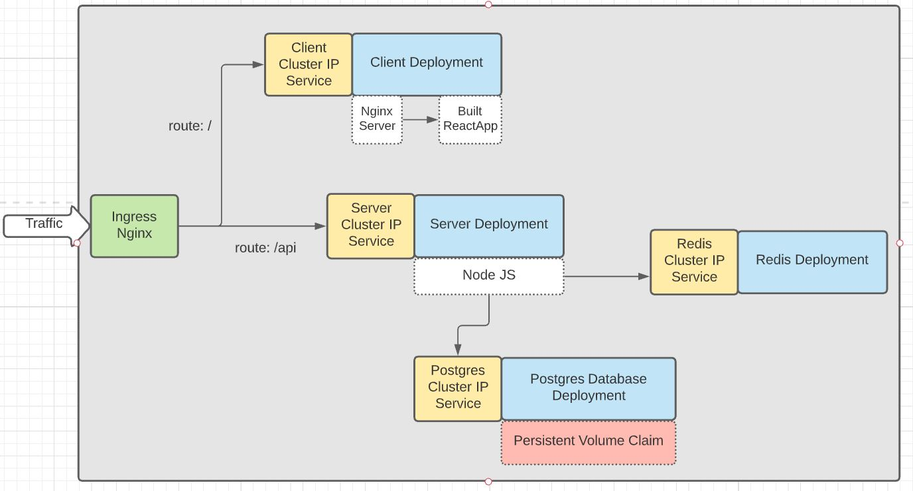
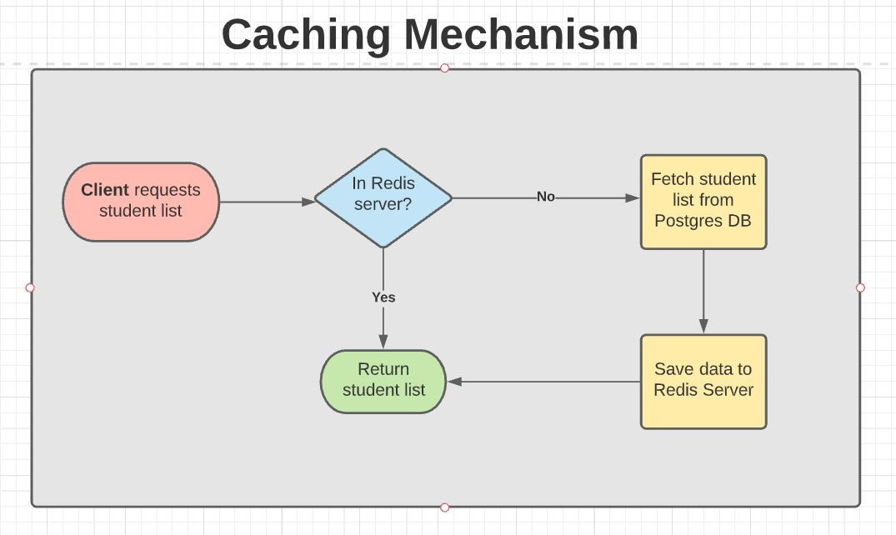
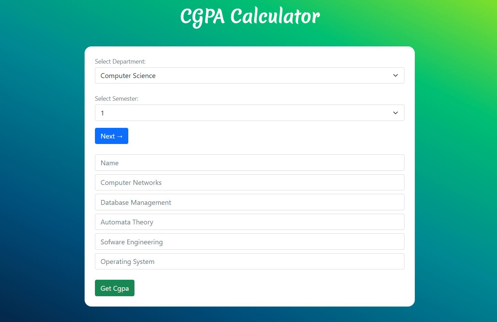
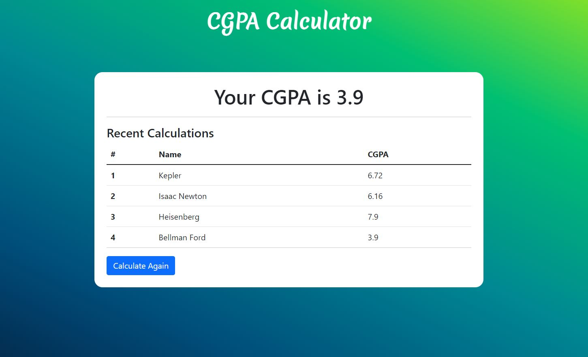
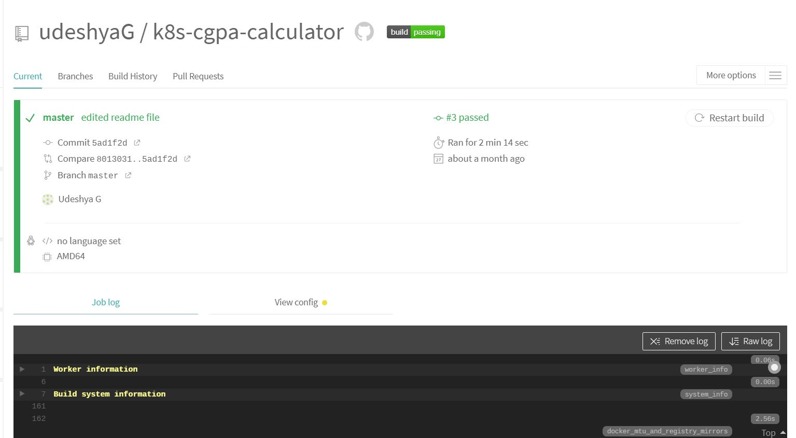
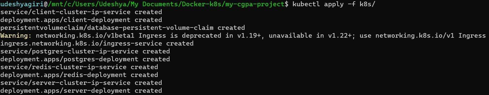

# Kubernetes CGPA Calculator

### [Click here](https://lucid.app/lucidchart/invitations/accept/inv_9ea862e3-6702-4d87-b85f-c2c20773860c?viewport_loc=-251%2C-2415%2C2482%2C1202%2C0_0) to view architecture diagrams

### Technology Used 🌟

- Kubernetes (Container Orchestration)
- Docker 🐳 (Containerization)
- Travis CI 👷‍♂️ (Testing and Continuous Integration)
- React ⚛ (frontend)
- Node JS, Express (backend)
- Postgres (database) 🐘
- Redis (caching) 

---

### Kubernetes Cluster Diagram


### Explanation
<table>
    <tbody>
    <tr>
      <th>Deployment</th>
      <th>Description</th>
    </tr>
    <tr>
      <td>Client</td>
      <td>
        <ul>
          <li>This is the front end of the app</li>
          <li>The client container has <strong>Nginx</strong> installed with the built react code</li>
          <li>Nginx serves the built react app from <code>build</code> folder</li>
        </ul>
      </td>
    </tr>
    <tr>
      <td>Server</td>
      <td>
        <ul>
          <li>Handles request to <code>/api</code></li>
          <li>Backend of the application. Handles connection to Postgres and Redis</li>
          <li>Handles calculation logic</li>
        </ul>
      </td>
    </tr>
    <tr>
      <td>Postgres</td>
      <td>
        <ul>
          <li>Handles all the data of the application</li>
          <li>Uses a <strong>Persistent Volume Claim</strong> to persist data even if pod crashes</li>
        </ul>
      </td>
    </tr>
    <tr>
      <td>Redis</td>
      <td>
        <ul>
          <li>In Memory data store used as a cache</li>
          <li>Stores data as simple key value pairs</li>
        </ul>
      </td>
    </tr>
  </tbody>
</table>

---

### Caching Mechanism

- Server gets data from the Redis server
- If list is empty then server gets data from Postgres 
- This data is added to Redis

---

### Screenshots
1. Homepage - Enter name and semester. This gives you the list of subjects. Enter marks


2. List of names and CGPA. Caching Mechanism Applied here


3. Travis CI dashboard


---

### Install and run locally
Setup the Ingress Nginx Controller
```
kubectl apply -f https://raw.githubusercontent.com/kubernetes/ingress-nginx/controller-v0.48.1/deploy/static/provider/cloud/deploy.yaml
```

Check the installation
```
kubectl get pods -n ingress-nginx
```

Create all the Kubernetes Objects
```
kubectl apply -f k8s/
``` 


If there is an error try deleting the server pod. An error may occur if the server pod is started before Redis and Postgres
```
kubectl delete pod <pod_name>
```

Check out the app on `localhost:80`